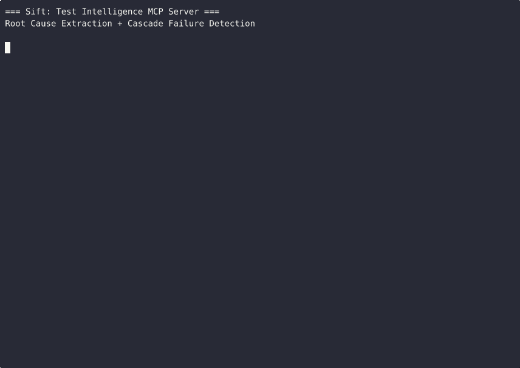
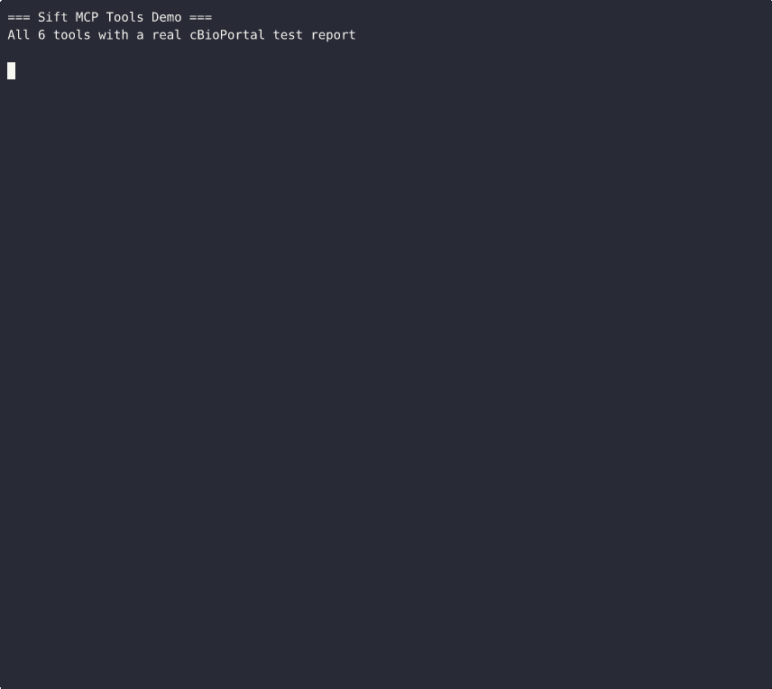
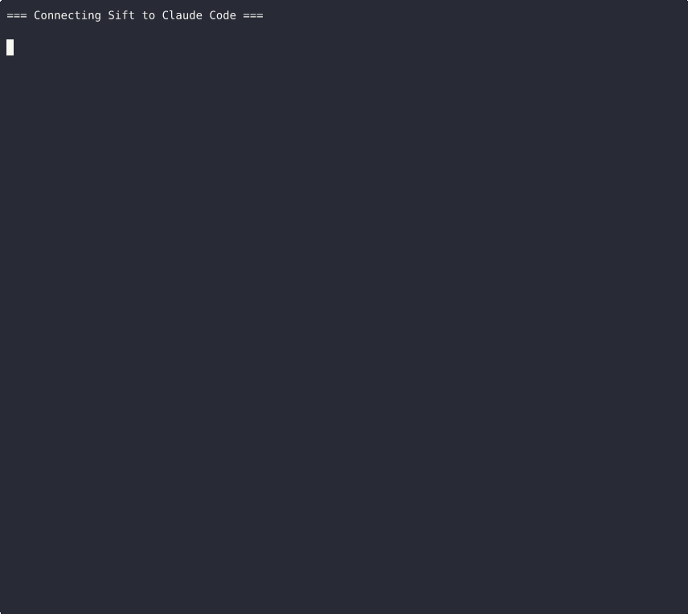
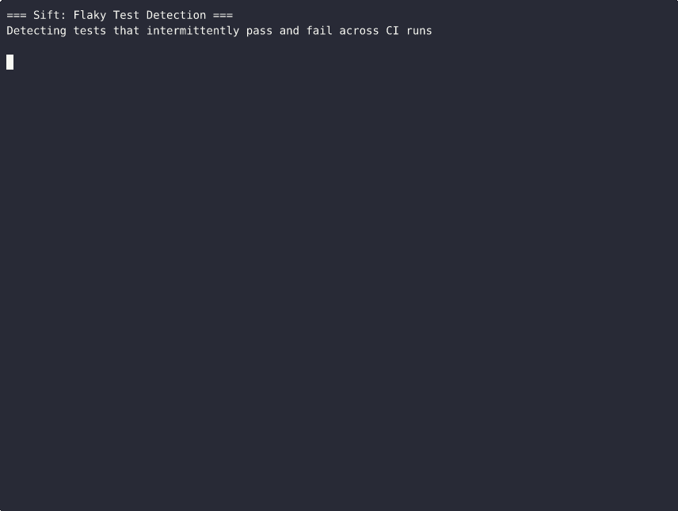
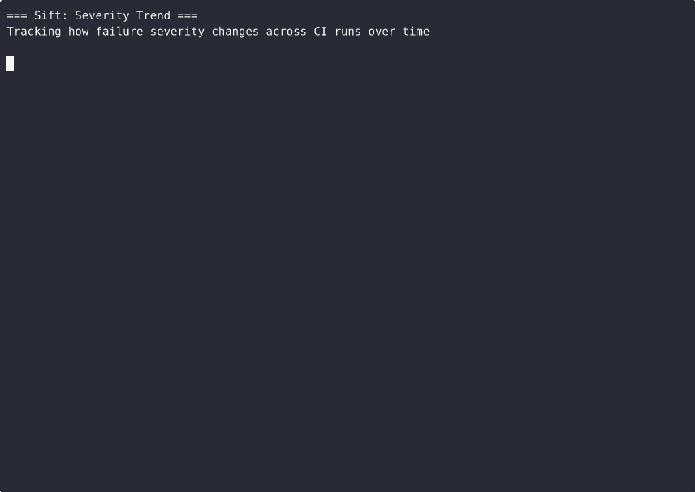
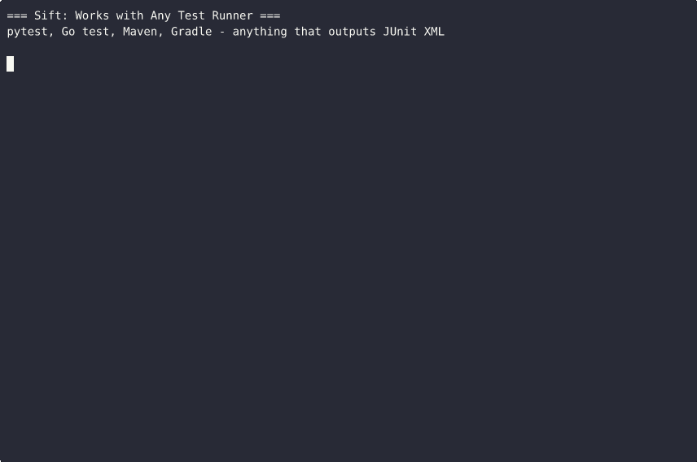
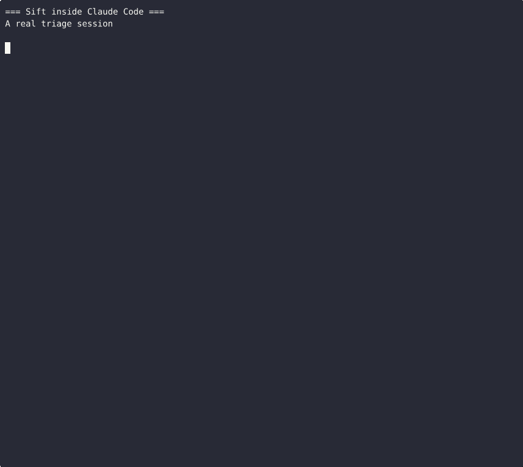

[](LICENSE) [](COMMERCIAL_LICENSE.md) [](CONTRIBUTING.md) 

MCP server for test intelligence. Parses JUnit XML reports, extracts root causes, detects cascade failures, deduplicates errors via fingerprinting, and tracks failure history in SQLite. Exposes results as 6 MCP tools that return structured JSON to AI agents.

## Demos

### Root Cause Extraction + Cascade Detection

cBioPortal test report: 220 failures, 2 root causes, 88% cascade.



### All 6 MCP Tools

Ingest, analyze, query history, detect flaky tests, track severity trends.



### Claude Code Integration

One command to install. Claude Code gets 6 tools automatically.



### Flaky Test Detection

Two CI runs with different failures — sift identifies which tests are flaky.



### Severity Trend

A week of CI runs — see how critical vs high failures shift over time.



### Works with Any Test Runner

pytest, Go test, Maven, Gradle — anything that outputs JUnit XML.



### Claude Code Triage Conversation

200+ failures reduced to 2 actionable fixes in one conversation.



## Quick Install

### Claude Code (one-liner)

```bash
claude mcp add sift -- npx sift-mcp
```

### npx (any MCP client)

```bash
npx sift-mcp
```

This downloads the correct binary for your platform and runs the MCP server on stdio.

## Manual Setup

### Prerequisites

- **Go 1.24+** ([install](https://go.dev/dl/))

### 1. Clone and build

```bash
git clone https://github.com/sift-mcp/sift-mcp.git
cd sift-mcp
go build -o sift ./cmd/server
```

This produces the `./sift` binary.

### 2. Configure your AI tool

#### Claude Code

```bash
claude mcp add sift -- /absolute/path/to/sift
```

Or add to `.mcp.json` in your project root (or `~/.claude/.mcp.json` for global):

```json
{
  "mcpServers": {
    "sift": {
      "type": "stdio",
      "command": "/absolute/path/to/sift",
      "env": {
        "SIFT_DB_PATH": "/absolute/path/to/sift.db"
      }
    }
  }
}
```

Restart Claude Code. The tools will appear automatically.

#### Cursor

Go to **Settings > MCP Servers > Add Server**:
- Name: `sift`
- Command: `/absolute/path/to/sift`
- Environment: `SIFT_DB_PATH=/absolute/path/to/sift.db`

#### Other MCP clients

Sift uses stdio transport. Any MCP client that supports stdio can connect by running the binary as a subprocess.

### 3. Verify it works

After configuring, ask your AI assistant:

> "Use the get_report_stats tool to check if Sift is connected."

It should return stats (zeroed out on first run). If you see an error, check that the binary path is absolute and the binary has execute permissions (`chmod +x sift`).

## Usage

### Ingesting test reports

Sift accepts JUnit XML reports (pytest, Jest, Maven Surefire, Go test, Cargo test, etc.).

After running your tests, ask the AI assistant:

> "Run my tests and ingest the results with Sift."

Or ingest manually — the `ingest_report` tool takes base64-encoded XML:

```bash
# Generate a JUnit XML report (examples for common frameworks)
pytest --junitxml=report.xml
go test ./... -v 2>&1 | go-junit-report > report.xml
npx jest --reporters=jest-junit

# The AI agent handles base64 encoding automatically when you say:
# "Ingest report.xml with Sift"
```

### What the AI gets back

Example `ingest_report` response:

```json
{
  "report_id": "abc-123",
  "total_tests": 308,
  "failed": 220,
  "passed": 81,
  "skipped": 7,
  "failure_groups": [
    {
      "root_cause": "Docker daemon not available (required by Testcontainers)",
      "error_classification": "java.lang.IllegalStateException",
      "fingerprint": "212e15cee360035a",
      "category": "infrastructure",
      "affected_tests": 56,
      "original_failure_count": 6,
      "cascade_failure_count": 50,
      "affected_suites": ["ClickhouseMutationMapperTest (4)", "ClickhouseClinicalDataMapperTest (17)"]
    },
    {
      "root_cause": "DataSource not configured: Failed to configure a DataSource: 'url'",
      "error_classification": "java.lang.IllegalStateException",
      "category": "infrastructure",
      "affected_tests": 38,
      "original_failure_count": 4,
      "cascade_failure_count": 34
    },
    {
      "root_cause": "Expected status 404 but was 400",
      "error_classification": "java.lang.AssertionError",
      "category": "assertion",
      "affected_tests": 2,
      "original_failure_count": 2,
      "cascade_failure_count": 0
    }
  ],
  "cascade_summary": {
    "total_original_failures": 12,
    "total_cascade_failures": 84,
    "cascade_percentage": 87.5
  },
  "delta": {
    "new_failures": 96,
    "fixed_since_last": 0,
    "recurring": 0
  },
  "summary": "220/308 tests failed from 3 root causes (12 original, 84 cascading). Categories: 94 infrastructure, 2 assertion."
}
```

3 root causes from 220 failures. 87.5% were cascade noise.

## Available MCP Tools

| Tool | What it does |
|---|---|
| `ingest_report` | Parse a base64-encoded JUnit XML report, run analysis, store results |
| `analyze_results` | Re-analyze a stored report by ID with updated historical context |
| `get_failure_history` | Show how many times a specific test has failed and when |
| `get_flaky_tests` | Find tests that intermittently pass and fail |
| `get_report_stats` | Aggregate pass/fail rates and top failing tests over a time range |
| `get_severity_trend` | Track how failure severity changes over time (by hour/day/week) |

## Configuration

| Environment Variable | Default | Description |
|---|---|---|
| `SIFT_DB_PATH` | `sift.db` (current directory) | Path to the SQLite database file |

The database is created automatically on first run.

## How it works

```
JUnit XML ──→ Streaming Parser ──→ Analysis Pipeline ──→ SQLite DB
                                        │
                                   6 stages:
                                   1. Extract failures + classify severity
                                   2. Root cause extraction (Caused-by chains, pattern matching)
                                   3. Fingerprint errors (normalize → SHA-256 hash)
                                   4. Enrich with historical context from DB
                                   5. Cascade detection (identify noise vs. originals)
                                   6. Summarize (group by root cause, fold cascades)
                                        │
                                        ▼
                              MCP Tools ──→ AI Agent
                          (structured JSON)   (generates suggestions)
```

- **Streaming parser** — `xml.NewDecoder` token-by-token, handles 100MB+ files without loading into memory
- **Root cause extraction** — walks `Caused by:` chains, classifies by priority (Docker/Testcontainers > DataSource > BeanCreation > innermost cause > assertion > fallback)
- **Cascade detection** — identifies "failure threshold" / "skipping repeated attempt" patterns, links back to originals via class or package-prefix matching
- **Error fingerprinting** — normalizes stack traces (strips timestamps, thread IDs, memory addresses), SHA-256 hashes, deduplicates across runs
- **Historical enrichment** — failure counts (24h, 7d), first/last seen, flakiness per test
- **Token efficiency** — full stack traces stored in DB but never sent to the agent; only root causes and structured summaries returned
